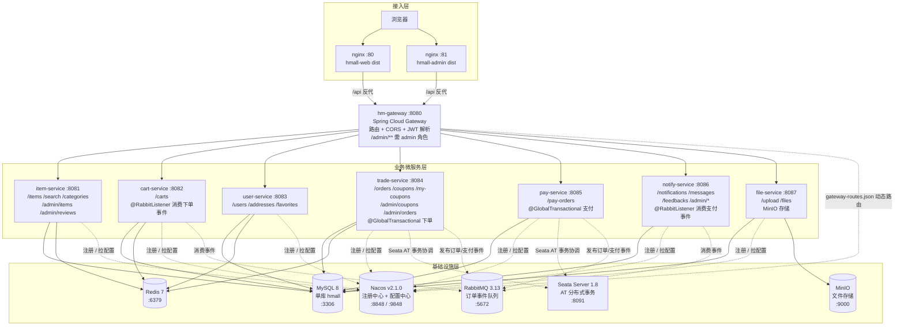
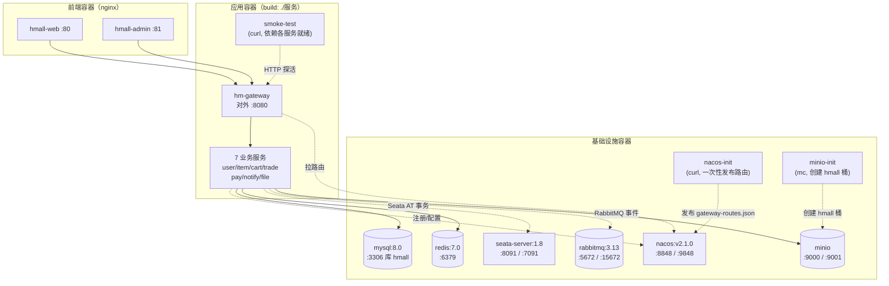

# 系统架构与部署拓扑

## 1. 系统分层架构图

从浏览器到数据层的完整分层。请求统一经 `hm-gateway` 路由与 JWT 鉴权后分发到各业务服务；
所有服务共享同一 MySQL 库与 Redis，并向 Nacos 注册、从 Nacos 拉取配置（含网关动态路由）。
跨服务事务由 Seata AT 协调，异步事件通过 RabbitMQ 传递。

**鉴权要点**：网关对部分路径放行（`/search`、`/users/login`、`/users/register`、
`/users/send-code`、`/notifications/active`、`/upload`、`/files`），其余请求需携带
合法 JWT；`/admin/**` 额外要求 `admin` 角色。详见
[03-sequence-diagrams.md](03-sequence-diagrams.md) 的鉴权时序。

## 2. 部署拓扑（docker-compose）

`docker-compose.yml` 将**整个后端栈容器化**：除基础设施外，`hm-gateway`、全部 7 个业务服务
都通过 `build: ./<服务>` 构建镜像运行，另有一次性 `nacos-init`（发布路由配置）、
`minio-init`（创建存储桶）与 `smoke-test`（依赖各服务就绪后跑冒烟）。仅 `:8080`（网关）、
前端 `:80/:81` 与基础设施端口对外暴露，服务间在 compose 网络内以服务名互访。

> 初始化：`docs/sql/init-all-tables.sql` 建表与种子数据；
> `scripts/init-nacos-routes.sh` 向 Nacos 发布 `gateway-routes.json`；
> `minio-init` 容器自动创建 `hmall` 存储桶并设置公开下载权限。
>
> 中间件集成状态：Seata AT（分布式事务）、RabbitMQ（异步事件）、MinIO（文件存储）已全部接入；
> Elasticsearch 未集成，商品搜索走 DB。详见 [README.md](README.md)。
