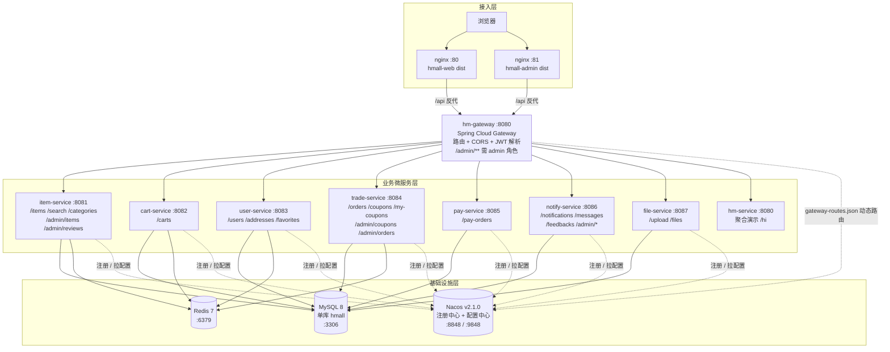
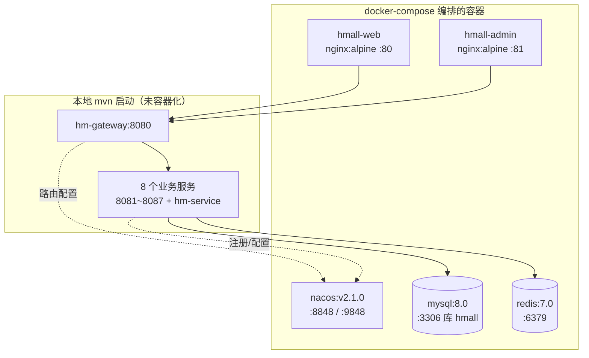

# 系统架构与部署拓扑

## 1. 系统分层架构图

从浏览器到数据层的完整分层。请求统一经 `hm-gateway` 路由与 JWT 鉴权后分发到各业务服务；
所有服务共享同一 MySQL 库与 Redis，并向 Nacos 注册、从 Nacos 拉取配置（含网关动态路由）。

**鉴权要点**：网关对部分路径放行（`/search`、`/users/login`、`/users/register`、
`/users/send-code`、`/notifications/active`、`/upload`、`/files`、`/hi`），其余请求需携带
合法 JWT；`/admin/**` 额外要求 `admin` 角色。详见
[03-sequence-diagrams.md](03-sequence-diagrams.md) 的鉴权时序。

## 2. 部署拓扑（docker-compose）

`docker-compose.yml` **实际编排的容器**如下。业务微服务在开发期以本地 `mvn` 启动、
**未容器化**（图中虚线框标注）。

> 初始化：`docs/sql/init-all-tables.sql` 建表与种子数据；
> `scripts/init-nacos-routes.sh` 向 Nacos 发布 `gateway-routes.json`。
>
> ⚠️ 注意：CLAUDE.md 提到的 Seata / RabbitMQ / MinIO / Elasticsearch **未在 compose 中编排、未在代码接入**，
> 详见 [README.md](README.md) 的差异说明。
