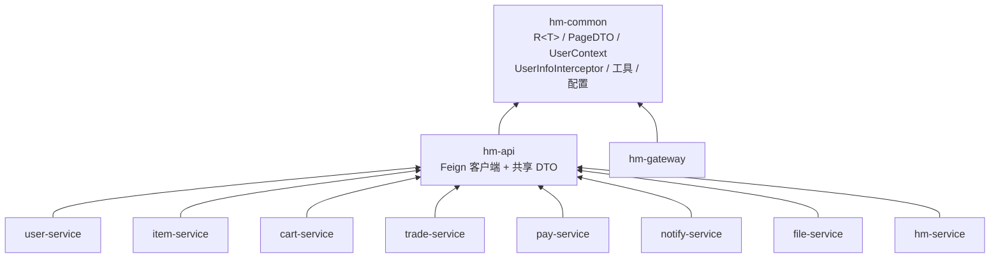
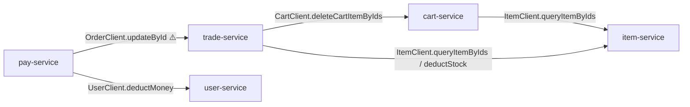

# 模块依赖与跨服务调用

## 1. Maven 模块依赖图

聚合 pom 下 11 个模块。依赖方向统一为：**业务服务 → `hm-api` → `hm-common`**。
`hm-common` 提供契约类型（`R<T>`/`PageDTO`）、`UserContext`、拦截器、工具与基础配置；
`hm-api` 在其之上定义 Feign 客户端与共享 DTO。

> `hm-gateway` 仅依赖 `hm-common`（不经 Feign 做业务调用，自身用 `JwtTool` 解析 JWT）。

## 2. Feign 跨服务调用图

`hm-api/.../client/` 下共 **9 个** Feign 客户端定义。但**只有 `cart-service`、`trade-service`、
`pay-service` 标注了 `@EnableFeignClients` 并真正发起调用**；下图仅画**实际存在的调用边**（实线），
边上标注被调用的方法。

**客户端清单（9 个）**

| 客户端 | `@FeignClient` 目标 | 是否被调用 | 调用方 / 说明 |
| --- | --- | --- | --- |
| `ItemClient` | item-service | ✅ 已用 | cart-service、trade-service：`queryItemByIds`、`deductStock` |
| `CartClient` | cart-service | ✅ 已用 | trade-service：`deleteCartItemByIds`（下单后清购物车） |
| `UserClient` | user-service | ✅ 已用 | pay-service：`deductMoney`（仅此一个方法，无收藏方法） |
| `OrderClient` | order-service ⚠️ | ✅ 已用 | pay-service：`updateById`（支付成功回写订单状态） |
| `CouponClient` | trade-service | ⬜ 已定义未调用 | 契约存在，当前无服务注入使用 |
| `ReviewClient` | item-service | ⬜ 已定义未调用 | 同上 |
| `FavoriteClient` | user-service | ⬜ 已定义未调用 | 同上 |
| `FileClient` | file-service | ⬜ 已定义未调用 | 同上 |
| `NotificationClient` | notify-service | ⬜ 已定义未调用 | 同上 |

> ⚠️ **命名陷阱**：`OrderClient` 的 `@FeignClient` value 写作 `"order-service"`，
> 但实际注册的服务名是 **`trade-service`**（见 `trade-service` 的 `bootstrap.yaml`）。
> 阅读/排障时勿被名字误导——它指向的是 trade-service。
>
> ⚠️ 另 5 个客户端（Coupon/Review/Favorite/File/Notification）**仅有契约定义、当前无任何服务实际调用**
> （仅 cart/trade/pay 启用了 `@EnableFeignClients`），故未画入调用图。对应业务多由各服务直接走
> Controller→Service→DB 完成。
