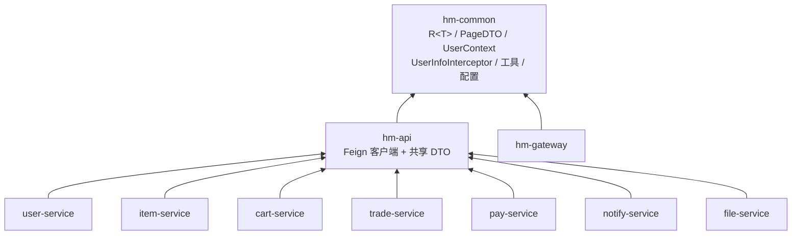
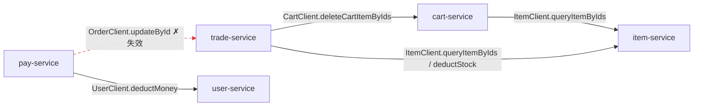

# 模块依赖与跨服务调用

## 1. Maven 模块依赖图

聚合 pom 下 10 个模块。依赖方向统一为：**业务服务 → `hm-api` → `hm-common`**。
`hm-common` 提供契约类型（`R<T>`/`PageDTO`）、`UserContext`、拦截器、工具与基础配置；
`hm-api` 在其之上定义 Feign 客户端与共享 DTO。

> `hm-gateway` 仅依赖 `hm-common`（不经 Feign 做业务调用，自身用 `JwtTool` 解析 JWT）。

## 2. Feign 跨服务调用图

`hm-api/.../client/` 下共 **9 个** Feign 客户端定义。但**只有 `cart-service`、`trade-service`、
`pay-service` 标注了 `@EnableFeignClients`**。下图实线为**目标服务名与路径都对得上、运行时可命中**的
调用；红色虚线为**代码里发起、但目标服务名未注册（命中不了）的失效调用**。

**客户端清单（9 个）**

| 客户端 | `@FeignClient` 目标 | 运行时状态 | 调用方 / 说明 |
| --- | --- | --- | --- |
| `ItemClient` | item-service | ✅ 可命中 | cart-service、trade-service：`GET /items`、`PUT /items/stock/deduct` |
| `CartClient` | cart-service | ✅ 可命中 | trade-service：`DELETE /carts`（下单后清购物车） |
| `UserClient` | user-service | ✅ 可命中 | pay-service：`PUT /money/deduct`（仅此一个方法，无收藏方法） |
| `OrderClient` | **order-service** | ❌ 失效 | pay-service 调 `updateById`，但**无服务注册为 `order-service`**，且其路径 `PUT /users` 也不匹配 trade 的 `PUT /orders` —— 运行时命中不了 |
| `CouponClient` | trade-service | ⬜ 已定义未调用 | 契约存在，当前无服务注入使用 |
| `ReviewClient` | item-service | ⬜ 已定义未调用 | 同上 |
| `FavoriteClient` | user-service | ⬜ 已定义未调用 | 同上 |
| `FileClient` | file-service | ⬜ 已定义未调用 | 同上 |
| `NotificationClient` | notify-service | ⬜ 已定义未调用 | 同上 |

> ⚠️ **OrderClient 是一条失效调用**：`@FeignClient("order-service")`，但全仓**没有任何服务的
> `spring.application.name` 是 `order-service`**（订单服务注册名为 `trade-service`）；其声明的
> `@PutMapping("/users")` 与 trade-service 实际的订单更新端点 `@PutMapping("/orders")` 也不一致。
> 因此 pay-service 的 `orderClient.updateById(order)` 在当前配置下**无法真正回写订单状态**——
> 属遗留/未接通代码，排障时需留意。
>
> ⚠️ 另 5 个客户端（Coupon/Review/Favorite/File/Notification）**仅有契约定义、当前无任何服务实际调用**
> （仅 cart/trade/pay 启用了 `@EnableFeignClients`），故未画入调用图。对应业务多由各服务直接走
> Controller→Service→DB 完成。
