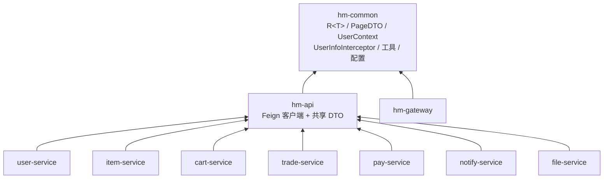
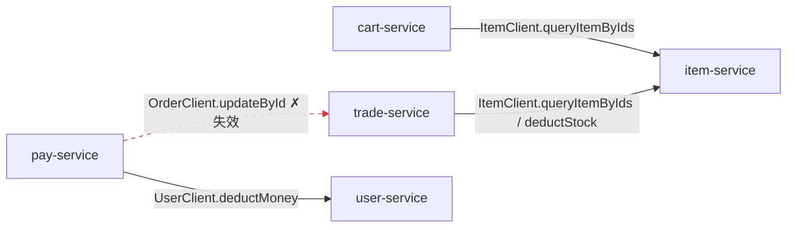

# 模块依赖与跨服务调用

## 1. Maven 模块依赖图

聚合 pom 下 10 个模块。依赖方向统一为：**业务服务 → `hm-api` → `hm-common`**。
`hm-common` 提供契约类型（`R<T>`/`PageDTO`）、`UserContext`、拦截器、工具与基础配置；
`hm-api` 在其之上定义 Feign 客户端与共享 DTO。

> `hm-gateway` 仅依赖 `hm-common`（不经 Feign 做业务调用，自身用 `JwtTool` 解析 JWT）。

## 2. Feign 跨服务调用图

`hm-api/.../client/` 下共 **9 个** Feign 客户端定义。但**只有 `cart-service`、`trade-service`、
`pay-service` 标注了 `@EnableFeignClients`**。下图实线为**目标服务名与路径都对得上、运行时可命中**的
调用；红色虚线为**代码里发起、但目标服务名未注册（命中不了）的失效调用**。

> **重要变更**：pay-service 的 `tryPayOrderByBalance` 方法已改用 **RabbitMQ 发布支付成功事件**
> （`PaySuccessEvent`），由 trade-service 异步消费来更新订单状态，不再直接调用失效的 `OrderClient`。
> `OrderClient` 虽仍存在于 `@EnableFeignClients` 配置中，但已不被业务代码使用。

**客户端清单（9 个）**

| 客户端 | `@FeignClient` 目标 | 运行时状态 | 调用方 / 说明 |
| --- | --- | --- | --- |
| `ItemClient` | item-service | ✅ 可命中 | cart-service、trade-service：`GET /items`、`PUT /items/stock/deduct` |
| `CartClient` | cart-service | ✅ 可命中 | 原 trade-service 调 `DELETE /carts`，**现已改用 RabbitMQ `OrderCreatedEvent` 异步清车**；该客户端仍在 `@EnableFeignClients` 中但不再被业务代码使用 |
| `UserClient` | user-service | ✅ 可命中 | pay-service：`PUT /money/deduct`（仅此一个方法，无收藏方法） |
| `OrderClient` | **order-service** | ❌ 失效 | 原 pay-service 调 `updateById`，**现已改用 RabbitMQ 事件异步更新订单**；该客户端虽仍在 `@EnableFeignClients` 中但不再被业务代码使用 |
| `CouponClient` | trade-service | ⬜ 已定义未调用 | 契约存在，当前无服务注入使用 |
| `ReviewClient` | item-service | ⬜ 已定义未调用 | 同上 |
| `FavoriteClient` | user-service | ⬜ 已定义未调用 | 同上 |
| `FileClient` | file-service | ⬜ 已定义未调用 | 同上 |
| `NotificationClient` | notify-service | ⬜ 已定义未调用 | 同上 |

> ⚠️ **OrderClient 已失效但不再影响业务**：`@FeignClient("order-service")` 指向未注册的服务名，
> 路径 `PUT /users` 也不匹配 trade-service 的 `PUT /orders`。但 pay-service 已改用 **RabbitMQ 发布
> `PaySuccessEvent`**，由 trade-service 异步消费更新订单状态，不再依赖此 Feign 客户端。
>
> ⚠️ 另 5 个客户端（Coupon/Review/Favorite/File/Notification）**仅有契约定义、当前无任何服务实际调用**
> （仅 cart/trade/pay 启用了 `@EnableFeignClients`），故未画入调用图。对应业务多由各服务直接走
> Controller→Service→DB 完成。
>
> **RabbitMQ 事件流**：trade-service 发布 `OrderCreatedEvent`（下单）和 `OrderStatusChangedEvent`（状态变更），
> pay-service 发布 `PaySuccessEvent`（支付成功）。消费者：cart-service（清车）、notify-service（站内信）、
> trade-service 自身（延时关单、订单状态更新）。详见 [03-sequence-diagrams.md](03-sequence-diagrams.md)。
