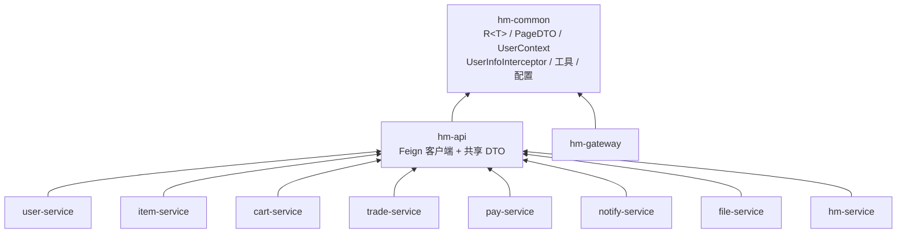
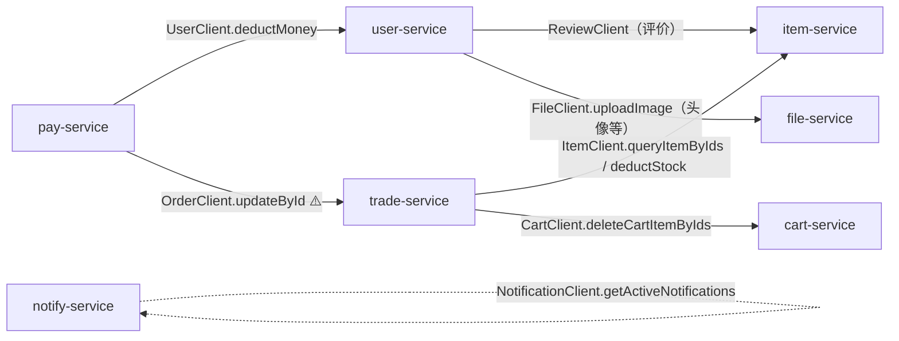

# 模块依赖与跨服务调用

## 1. Maven 模块依赖图

聚合 pom 下 11 个模块。依赖方向统一为：**业务服务 → `hm-api` → `hm-common`**。
`hm-common` 提供契约类型（`R<T>`/`PageDTO`）、`UserContext`、拦截器、工具与基础配置；
`hm-api` 在其之上定义 Feign 客户端与共享 DTO。

> `hm-gateway` 仅依赖 `hm-common`（不经 Feign 做业务调用，自身用 `JwtTool` 解析 JWT）。

## 2. Feign 跨服务调用图

`hm-api/.../client/` 下 8 个 Feign 客户端定义了服务间的实际调用契约。边上标注主要方法。

**客户端清单**

| 客户端 | 目标服务 | 主要方法 | 用途 |
| --- | --- | --- | --- |
| `ItemClient` | item-service | `queryItemByIds`、`deductStock` | 查商品价格、扣库存 |
| `CartClient` | cart-service | `deleteCartItemByIds` | 下单后清购物车 |
| `UserClient` | user-service | `deductMoney`、收藏增删 | 扣余额、收藏 |
| `OrderClient` | trade-service | `updateById` | 支付成功回写订单状态 |
| `CouponClient` | trade-service | 优惠券领取/查询 | 优惠券 |
| `ReviewClient` | item-service | 评价增删查 | 商品评价 |
| `NotificationClient` | notify-service | `getActiveNotifications` | 活跃公告 |
| `FileClient` | file-service | `uploadImage`、下载 | 文件 |

> ⚠️ **命名陷阱**：`OrderClient` 的 `@FeignClient` value 写作 `"order-service"`，
> 但实际注册的服务名是 **`trade-service`**（见 `trade-service` 的 `bootstrap.yaml`）。
> 阅读/排障时勿被名字误导——它指向的是 trade-service。
