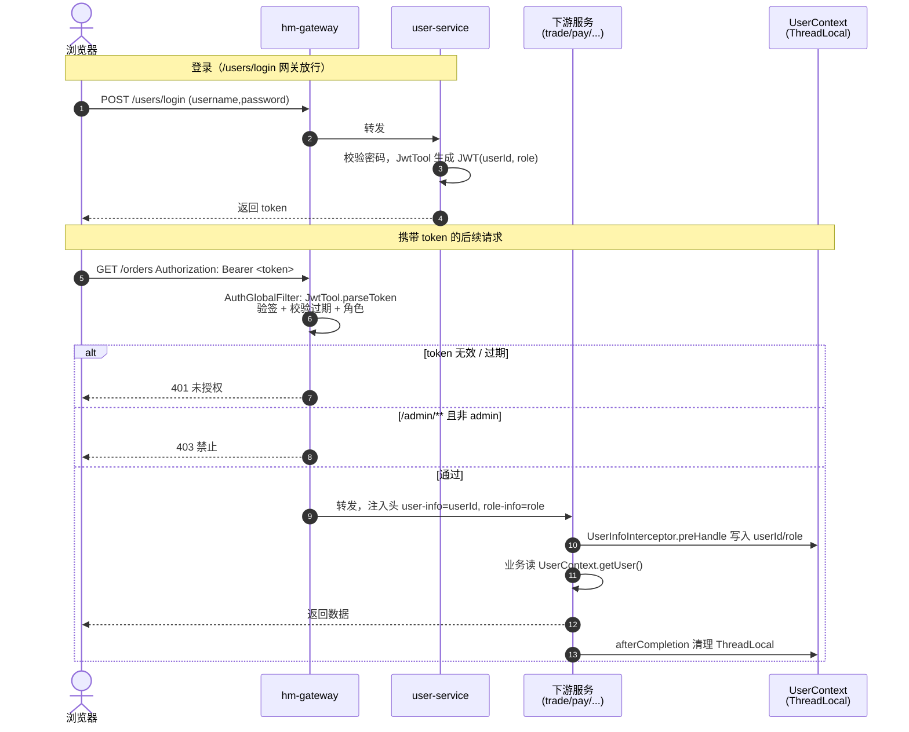
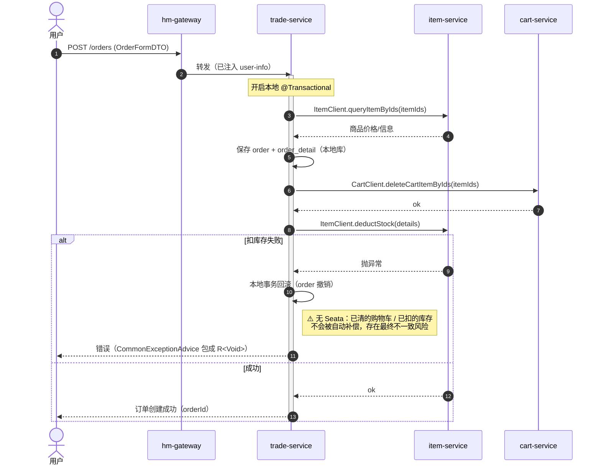
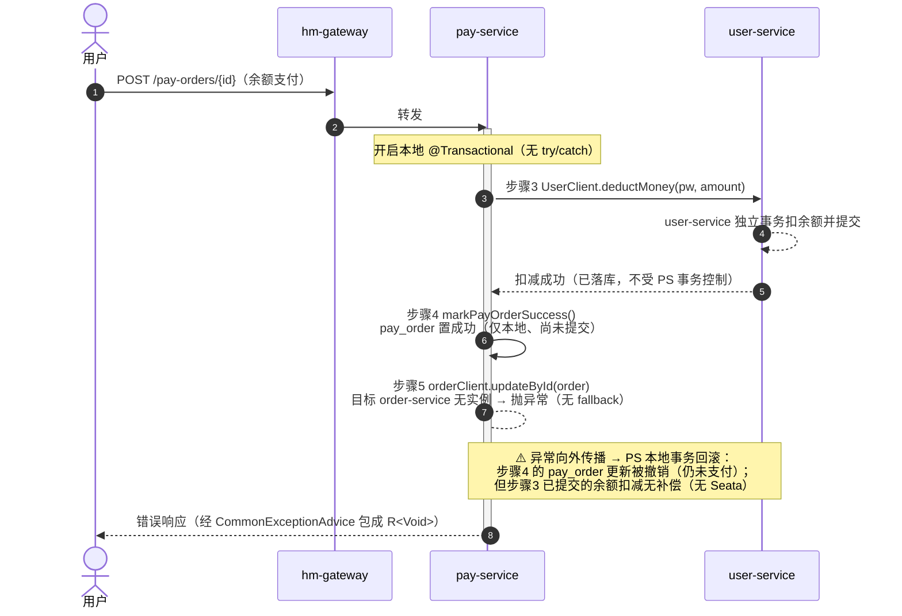

# 核心业务时序图

三条最关键的链路：JWT 登录与鉴权透传、下单、余额支付。所有跨服务调用均为**同步 Feign**，
**无 Seata 分布式事务**，仅依赖各服务本地 `@Transactional`。

## 1. JWT 登录与鉴权透传

登录后由 user-service 颁发 JWT；后续请求经网关解析 token，把用户身份以请求头
`user-info` / `role-info` 注入下游，下游 `UserInfoInterceptor` 写入 `UserContext`（ThreadLocal）。

## 2. 下单（trade-service `OrderServiceImpl.createOrder`）

## 3. 余额支付（pay-service `PayOrderServiceImpl.tryPayOrderByBalance`）

`tryPayOrderByBalance` 标注 `@Transactional` 且**无 try/catch、OrderClient 无 fallback/熔断**。
由于第 5 步的 `OrderClient` 指向未注册的 `order-service`（见 [02](02-module-dependencies.md)），
**当前每次余额支付都会在该步抛异常**，进而触发下面的失败流程——这是仓库现状，而非偶发分支。

> **结论（按真实代码）**：当前余额支付链路因 `OrderClient` 失效而无法正常完成——
> 余额被扣、但支付单回滚为未支付、订单状态不更新、用户收到错误。这是"无分布式事务 +
> 失效 Feign 客户端"叠加出的数据不一致缺陷，修复方向是修正 `OrderClient` 的服务名/路径
> 并为跨服务写操作引入补偿或本地消息表。
