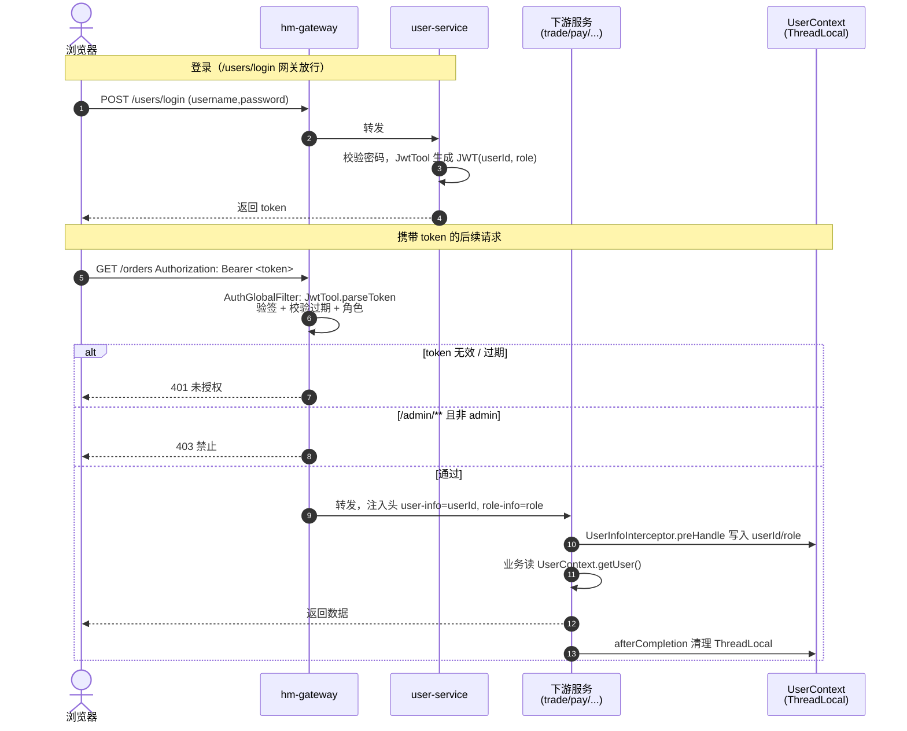
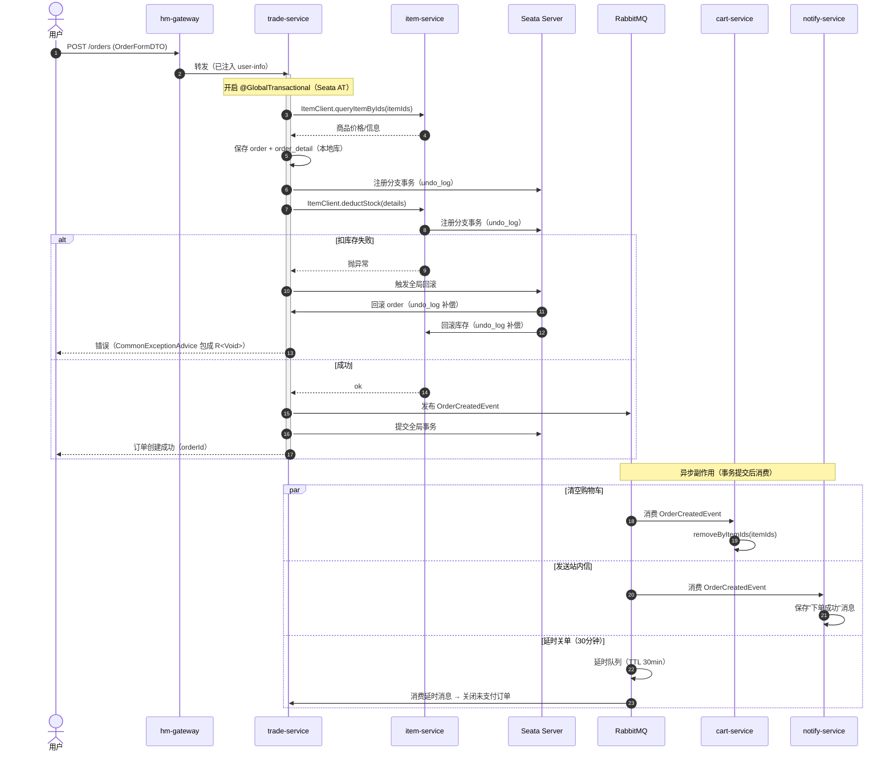
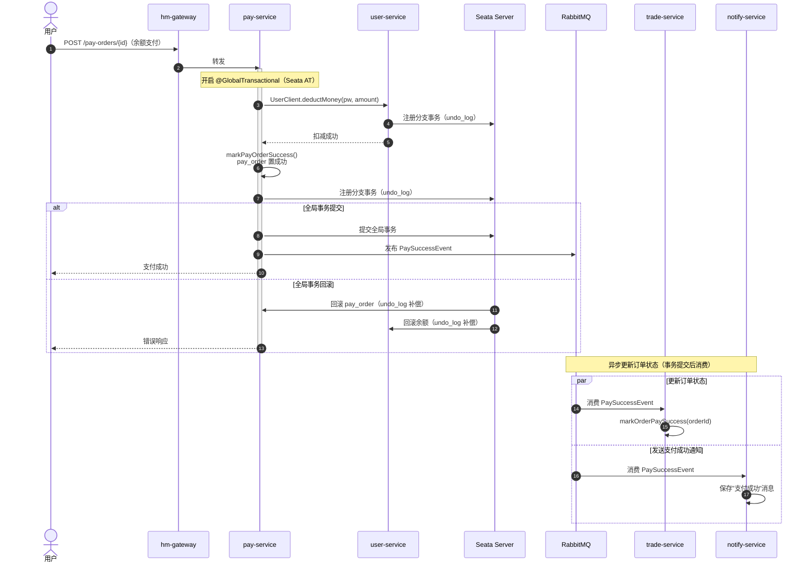

# 核心业务时序图

三条最关键的链路：JWT 登录与鉴权透传、下单、余额支付。跨服务事务由 **Seata AT** 协调，
异步副作用（清车、通知、延时关单、订单状态更新）通过 **RabbitMQ** 事件驱动。

## 1. JWT 登录与鉴权透传

登录后由 user-service 颁发 JWT；后续请求经网关解析 token，把用户身份以请求头
`user-info` / `role-info` 注入下游，下游 `UserInfoInterceptor` 写入 `UserContext`（ThreadLocal）。

## 2. 下单（trade-service `OrderServiceImpl.createOrder`）

## 3. 余额支付（pay-service `PayOrderServiceImpl.tryPayOrderByBalance`）

`tryPayOrderByBalance` 标注 `@GlobalTransactional` + `@Transactional`，
通过 Seata AT 协调跨服务事务。支付成功后发布 RabbitMQ 事件，由 trade-service 异步更新订单状态，
notify-service 发送支付成功通知。

> **架构改进**：原 `OrderClient` 失效问题已通过 **RabbitMQ 事件驱动** 解决——pay-service 发布
> `PaySuccessEvent`，trade-service 消费后异步更新订单状态。Seata AT 确保支付与余额扣减的原子性。
