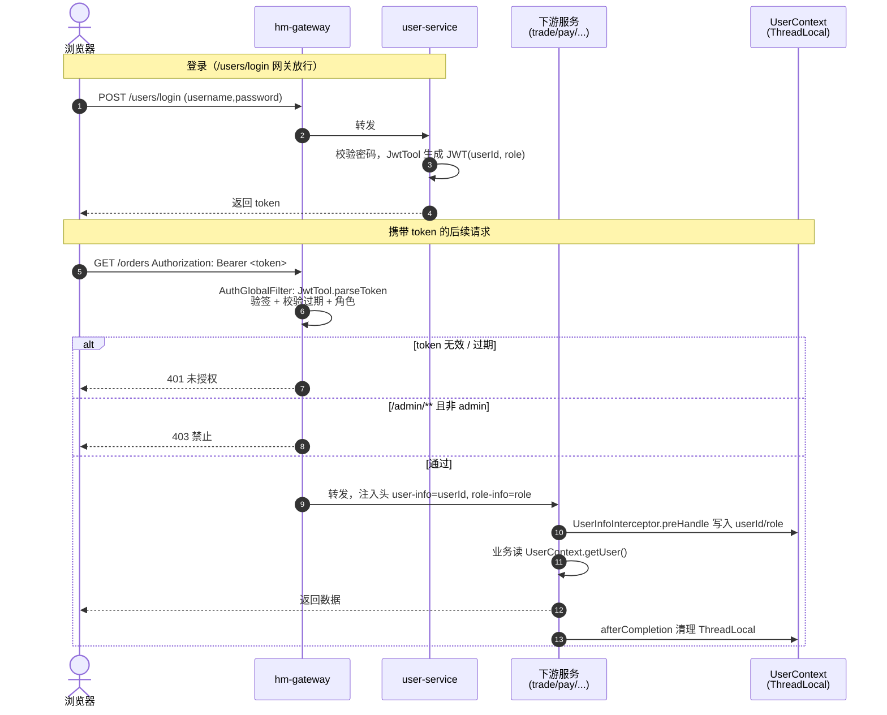
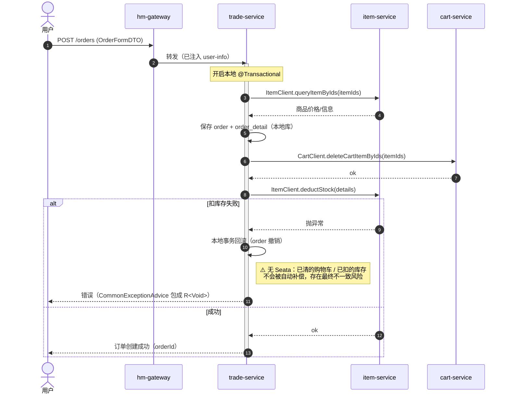
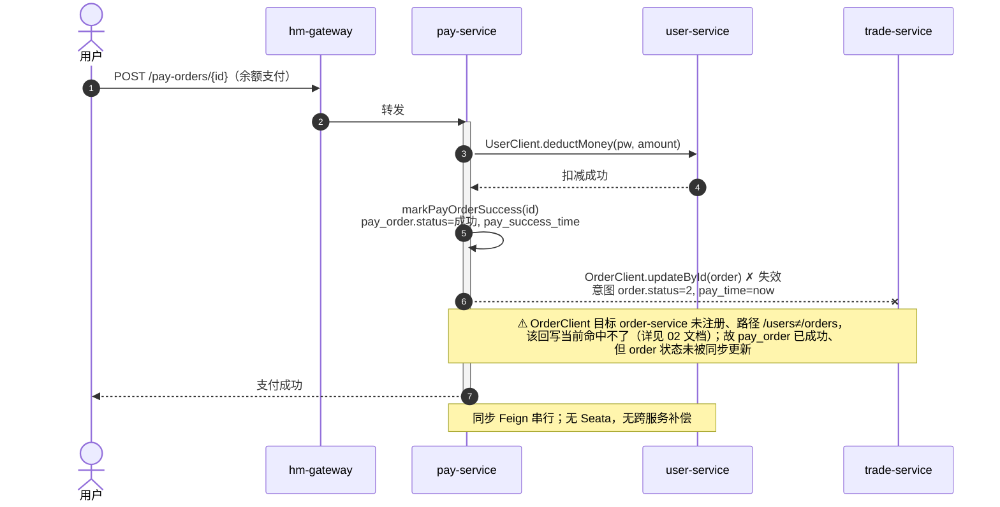

# 核心业务时序图

三条最关键的链路：JWT 登录与鉴权透传、下单、余额支付。所有跨服务调用均为**同步 Feign**，
**无 Seata 分布式事务**，仅依赖各服务本地 `@Transactional`。

## 1. JWT 登录与鉴权透传

登录后由 user-service 颁发 JWT；后续请求经网关解析 token，把用户身份以请求头
`user-info` / `role-info` 注入下游，下游 `UserInfoInterceptor` 写入 `UserContext`（ThreadLocal）。

## 2. 下单（trade-service `OrderServiceImpl.createOrder`）

## 3. 余额支付（pay-service `PayOrderServiceImpl.tryPayOrderByBalance`）

