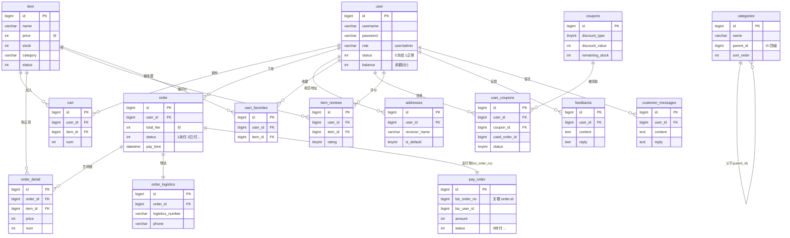

# 数据模型 E-R 概览

源自 `docs/sql/init-all-tables.sql`，**单库 `hmall`**，18 张表，所有服务共享同一数据库。
表间**无物理外键约束**，全部靠 `*_id` 字段做**逻辑关联**（下图关系线为业务语义，非 DB 级 FK）。
金额字段（`price`/`total_fee`/`amount`/`balance`）均以**整数分**存储。

## 独立表（无强关联，按业务读取）

| 表 | 归属服务 | 说明 |
| --- | --- | --- |
| `notifications` | notify-service | 站内公告，`/notifications/active` 取 `status=1` |
| `customer_messages` | notify-service | 客服留言（已含于上图，user_id 关联） |
| `feedbacks` | notify-service | 用户反馈（已含于上图） |
| `uploads` | file-service | 上传文件元数据（original_name / file_path / size） |
| `banners` | item/admin | 首页轮播图 |

> **关键关联说明**
> - `order` ↔ `pay_order` 通过 `pay_order.biz_order_no = order.id` 关联（一单一支付单）。
> - `user_coupons.used_order_id` 记录优惠券核销时所用订单。
> - `categories.parent_id = 0` 表示顶级分类，否则指向父分类（自引用树）。
