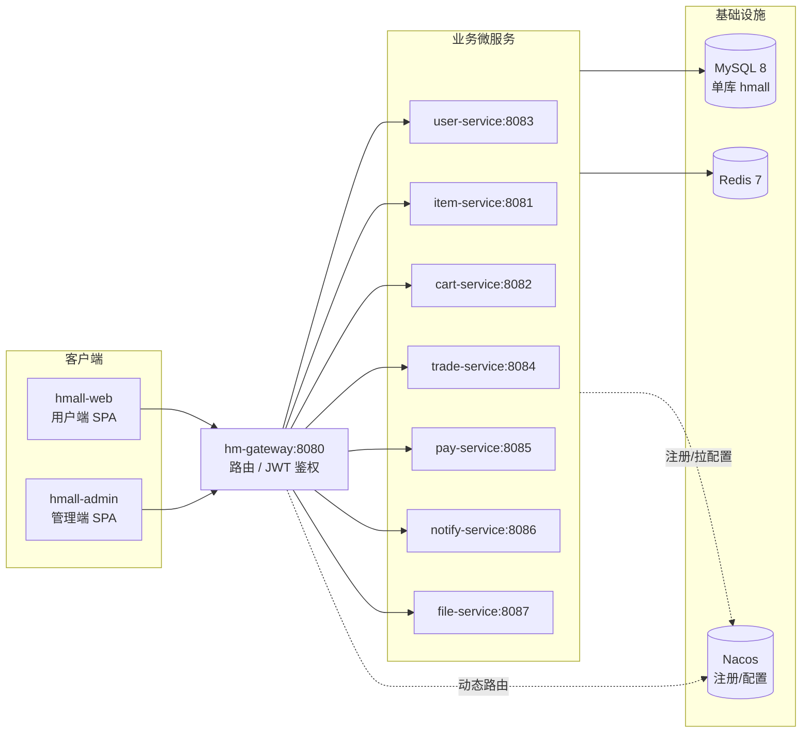

# 架构与流程图（docs/structure）

本目录用 **Mermaid 图（嵌入 Markdown）** 描述 hmall 微服务电商系统的结构与核心链路，
方便新成员与 agent 快速建立整体心智模型。所有图均按**仓库当前真实代码**绘制，
GitHub / VS Code / 多数 Markdown 预览器可直接渲染。

## 目录索引

| 文档 | 内容 |
| --- | --- |
| [01-system-architecture.md](01-system-architecture.md) | 系统分层架构图 + docker-compose 部署拓扑 |
| [02-module-dependencies.md](02-module-dependencies.md) | Maven 模块依赖图 + hm-api Feign 跨服务调用图 |
| [03-sequence-diagrams.md](03-sequence-diagrams.md) | JWT 鉴权透传 / 下单 / 余额支付 三条核心时序图 |
| [04-data-model.md](04-data-model.md) | 单库 18 张表的 E-R 概览图 |

## 系统全景（高层概览）

> 服务间业务调用通过 `hm-api` 的 Feign 客户端进行（见
> [02-module-dependencies.md](02-module-dependencies.md)），上图为简化省略。

## ⚠️ 现状 vs CLAUDE.md：声明但未接入的中间件

绘图前对代码做了实地核对。`CLAUDE.md` 的项目描述提到若干中间件，但**仓库当前代码并未真正接入**，
图中据实呈现，特此说明，避免误导：

| 中间件 | CLAUDE.md 描述 | 仓库真实状态 |
| --- | --- | --- |
| **Seata（TCC/AT）** | 协调下单分布式事务 | ❌ 无 Seata 配置。下单是**单库 + 本地 `@Transactional` + 同步 Feign**，跨服务失败靠本地事务回滚，无分布式事务补偿 |
| **RabbitMQ** | 站内信/消息异步 | ❌ 依赖在 `hm-common/pom.xml`，但**无 `@RabbitListener`、无 `rabbitTemplate.send()`**；notify-service 走纯 REST + DB |
| **MinIO** | 文件上传/签名 URL | ❌ docker-compose 未编排；file-service 以本地实现为主 |
| **Elasticsearch** | 商品搜索 | ❌ 未编排；搜索走 DB |

`docker-compose.yml` 实际只编排：**MySQL 8.0、Nacos v2.1.0、Redis 7.0、hmall-web(nginx:80)、hmall-admin(nginx:81)**。
业务微服务在开发期以本地 `mvn` 启动，未容器化。

## 维护约定

- 图随代码演进，改动相关链路时请同步更新对应图。
- 本目录不在 `scripts/knowledge_base.py` 的 tracks 覆盖范围内，不触发 KB lint；
  与 `docs/knowledge-base/` 是互补关系（KB 偏文字契约，本目录偏可视化）。
