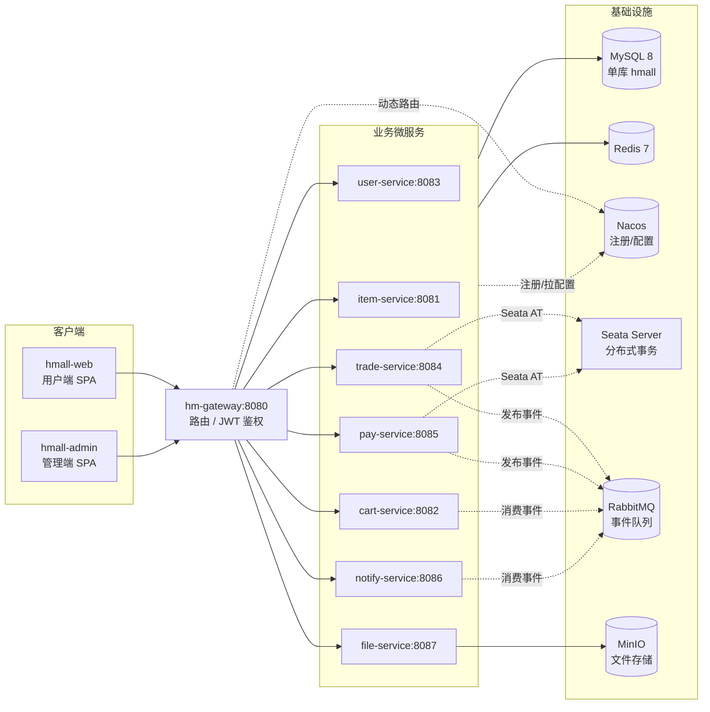

# 架构与流程图（docs/structure）

本目录用 **Mermaid 图（嵌入 Markdown）** 描述 hmall 微服务电商系统的结构与核心链路，
方便新成员与 agent 快速建立整体心智模型。所有图均按**仓库当前真实代码**绘制，
GitHub / VS Code / 多数 Markdown 预览器可直接渲染。

## 目录索引

| 文档 | 内容 |
| --- | --- |
| [01-system-architecture.md](01-system-architecture.md) | 系统分层架构图 + docker-compose 部署拓扑 |
| [02-module-dependencies.md](02-module-dependencies.md) | Maven 模块依赖图 + hm-api Feign 跨服务调用图 |
| [03-sequence-diagrams.md](03-sequence-diagrams.md) | JWT 鉴权透传 / 下单 / 余额支付 三条核心时序图 |
| [04-data-model.md](04-data-model.md) | 单库 20 张表的 E-R 概览图 |

## 系统全景（高层概览）

> 服务间业务调用通过 `hm-api` 的 Feign 客户端进行（见
> [02-module-dependencies.md](02-module-dependencies.md)），上图为简化省略。
> 异步事件通过 RabbitMQ 传递，跨服务事务由 Seata AT 协调。

## 中间件集成状态

经过近期 PR 集成，`CLAUDE.md` 中声明的中间件已全部接入（Elasticsearch 除外）：

| 中间件 | 集成状态 | 使用服务 | 说明 |
| --- | --- | --- | --- |
| **Seata AT** | ✅ 已集成 | trade-service、pay-service | `@GlobalTransactional` 协调下单与支付分布式事务 |
| **RabbitMQ** | ✅ 已集成 | trade-service、pay-service、cart-service、notify-service | 订单事件异步：下单清车、支付成功通知、延时关单 |
| **MinIO** | ✅ 已集成 | file-service | 文件上传/下载，docker-compose 编排 minio + minio-init |
| **Elasticsearch** | ❌ 未集成 | - | 商品搜索走 DB |

`docker-compose.yml` 编排的容器：基础设施 **MySQL 8.0、Nacos v2.1.0、Redis 7.0、RabbitMQ 3.13、Seata 1.8、MinIO** + 初始化容器 `nacos-init`、`minio-init`、
**hm-gateway 与全部 7 个业务服务（均通过 `build: ./<服务>` 构建镜像运行）** + 冒烟容器 `smoke-test`
+ 前端 **hmall-web(nginx:80)、hmall-admin(nginx:81)**。即整个后端栈都已容器化（详见
[01-system-architecture.md](01-system-architecture.md) 的部署拓扑）。

## 维护约定

- 图随代码演进，改动相关链路时请同步更新对应图。
- 本目录不在 `scripts/knowledge_base.py` 的 tracks 覆盖范围内，不触发 KB lint；
  与 `docs/knowledge-base/` 是互补关系（KB 偏文字契约，本目录偏可视化）。
- 中间件集成状态变更时，需同步更新 README.md 的集成状态表与相关架构图。
